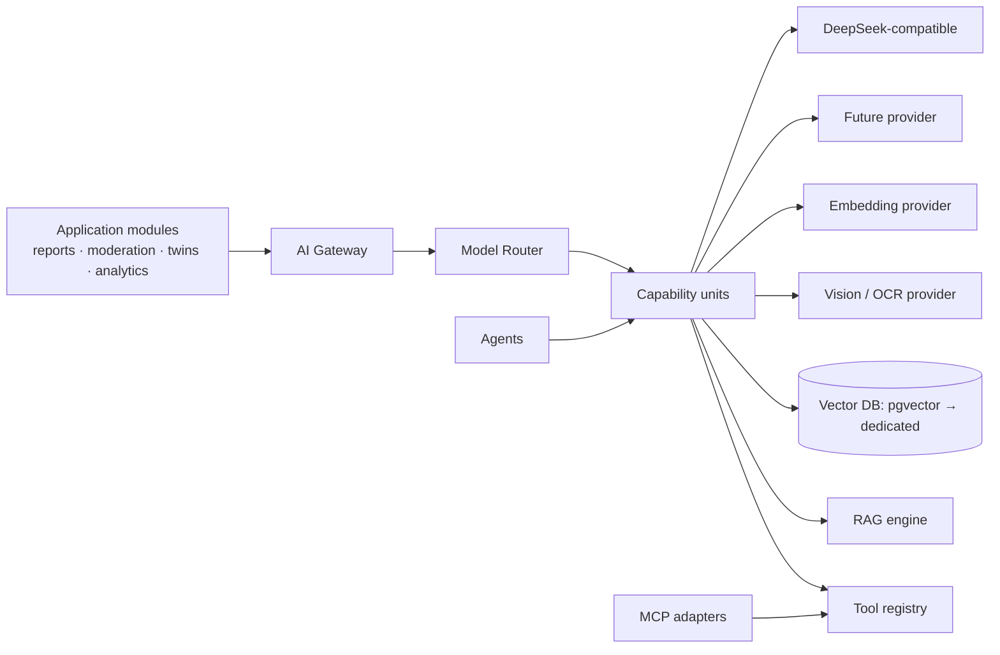

# AI ARCHITECTURE — Theek Karo

**Version:** 2.0 (Cycle 2, Phase 2)
**Date:** 2026-08-16
**Status:** Approved — design; Cycle-1 AI layer (gateway stubs, T4 pipeline,
review queue, eval harness) is the working baseline this expands.

---

## 1. Layer Model

**No business logic ever names a model or provider.** The router owns provider
choice; capability contracts are the only AI surface modules see.

## 2. AI Gateway

- OpenAI-compatible client against a provider chain (Cycle-1 carried):
  per-call timeout, fallback on HTTP/5xx, deterministic `stub` when no key is
  configured (dev/tests/eval) — the swap point is config, never code.
- Every call is logged as an `ai_runs` row: task kind, model, provider,
  latency, status, PII-insulated payload_in/out (ADR-019).

## 3. Model Router

- **Task→model registry** (data): each capability declares acceptable
  providers/models, cost/latency budgets, min confidence floors, and an eval
  holder name.
- Routing policy: prefer the configured primary; fall back on failure or
  floor-miss; record actuals for cost analytics; per-tenant quotas.
- Embeddings: one embedder for the corpus (1536-dim default; registry-specified
  dims; fallback embedder supported) — vector DB is pgvector now (ADR-038).

## 4. AI Capabilities (PRD §12 → contracts)

| Capability | Input | Output | Human gate |
|------------|-------|--------|-----------|
| Classification | report text/fields | category suggestions + confidence | category edit |
| Duplicate detection | report | candidate pairs + similarity | merge approval |
| Image analysis | evidence image | object/conditions, OCR text | none (T4-only) |
| OCR | image/doc | text with confidence | none (T4-only) |
| Severity suggestion | report | severity hint | caseworker confirm |
| Department routing | report/twin | department list + reasons | routing apply |
| Translation | text | locale target | community review (Phase 7) |
| Moderation assist | post/comment | risk flags | moderator decision |
| RAG-QA / comparison | query + corpora | drafted answer + citations | official post only |
| Resolution verification assist | before/after + evidence | congruence assessment | reviewer confirm |
| Analytics summarisation | metrics | narrative + caveats | publish gate |
| NL search | query | ranked refs + highlights | none (ranked view) |
| Civic assistant | conversation | answers + citations OR decline | none (T4) |

Each capability is a **pure function of typed inputs**: no hidden state,
schema-validated outputs, versioned prompts with eval-linked golden sets.

## 5. RAG

- **Corpora registry**: any corpus is a set of provenance records
  (external_sources + entity rows); ingestion only from licensed sources
  (PROVENANCE.md).
- Pipeline: filter-by-policy → chunk (registry-driven sizes) → embed
  (pgvector) → hybrid retrieve (vector + trigram/bm25) → re-rank
  (cross-encoder in V1) → cite with `source_id` + snippet.
- **Answer policy:** answer only if citations cover the claim; otherwise
  *decline with suggestions*. Never fabricate; never infer official status.
- Index refresh: worker rollups; version bumps re-embed deltas, never
  rewrite history.

## 6. Tools & Agents

- **Tool registry** (data-defined, same discipline as capabilities): search
  reports, geocode, boundary lookup, dataset lookup, template-safe
  notifications (no freeform send), analytics query (audited).
- **Agents** (Phase 9): plan–act loops over capability + tool units with a
  step budget and cost cap; every step is an `ai_runs` row; loops that end
  in an irreversible action (merge, strike, official response, delete) stop
  at a **human-in-the-loop gate** with a generated rationale + evidence links.
- Config-driven: agent definitions are registry rows (model, tools,
  budgets, gates), not code.

## 7. MCP

Optional adapter layer (ADR-016 reaffirmed): external agents can consume
*read-only* platform MCP servers (geography, datasets, citations) where it
demonstrably reduces integration cost; write-capable MCP surfaces are
phase-gated behind the same RBAC + audit as the API (ADR-040).

## 8. Eval & Safety

- Golden sets per capability; eval harness (Cycle-1 carried) computes
  accuracy/precision/recall and **floors** that the router enforces;
  floors gate provider promotion.
- T4 enforcement: schema CHECK + router contract; AI can never self-promote
  tiers.
- PII insulation in prompts/logs; provider contracts must prohibit training
  on platform data (documented, monitored).
- Human review queue for any sensitive decision (merge, strike, official
  wording) — carried from Cycle 1.
- Phase 14: resolution reviews accept an optional `ai_assessment` JSONB field
  (human reviewer-supplied or AI-drafted, never binding) — AI stays advisory;
  the review decision itself is always a human action.
- Cost/latency analytics per task-provider pair to feed router policy tuning.

## 9. Network & Failure Posture

- Gateway timeouts + retries with backoff; degraded mode = users see "AI
  temporarily unavailable" with the non-AI path intact (never a hard
  dependency on model availability).