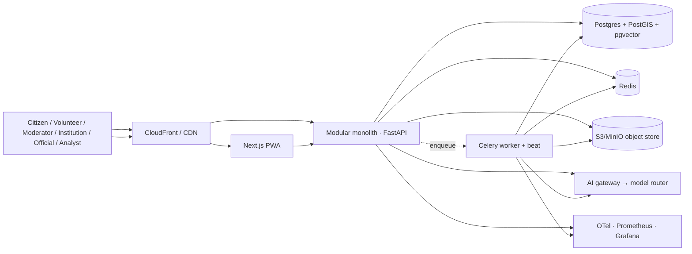
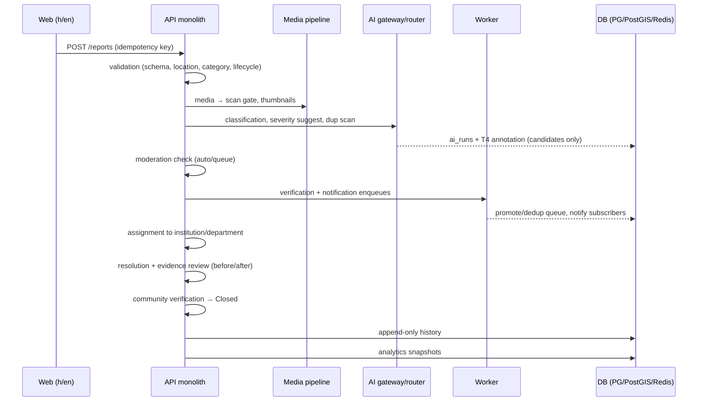

# SYSTEM ARCHITECTURE — Theek Karo

**Version:** 2.0 (Cycle 2, Phase 2 — System Architecture)
**Date:** 2026-08-16
**Status:** Approved — design doc; implementation lands in later phases on top
of the Cycle-1 reference baseline (`services/api` modular monolith, `apps/web`,
worker, observability, CI/CD — all green).

---

## 1. Overview & Key Decisions

- **Modular monolith first** (one FastAPI deployable; strict service-layer
  boundaries; only the Celery worker is separate) — carrying the Cycle-1
  baseline and formalised for the new scope (23 modules, §3).
- Every domain behaves like its own service *inside* the monolith: no
  cross-module SQL at the API layer; extraction is a measured decision, not
  a default.
- **Configuration over code** threads everything: geography hierarchy,
  categories, institutions, languages, state machines, and model routing.
- Provenance is a first-class type (§7, SECURITY §4): any data point without a
  declared tier/source is a defect.

## 2. Frontend

- Next.js 16 App Router + React 19 + TypeScript, Tailwind; PWA (manifest +
  service worker offline shell); hi/en web catalogs today, 15 languages by
  V1 (language registry-driven).
- Static/server-rendered public routes (twin profiles, report details);
  client islands for wizard, maps, dashboards; map-lite SVG now, real tile
  basemap behind the same marker/cluster API in V1.
- Talks only to the API via `/api/v1`; auth via bearer tokens in storage with
  the Cycle-1 conventions; accessibility/perf budgets enforced in CI.

## 3. Module Boundaries (modular monolith)

| Module | Responsibility | Baseline / cycle |
|--------|----------------|------------------|
| `identity` | authn (OTP/password, OAuth link V1, MFA-ready), sessions, JWT/refresh | Cycle-1 auth core; extend |
| `users` | profiles, roles, reputation (aggregate-only), persona registry | Cycle-1 users |
| `geography` | 12-level hierarchy registry, geometry, reverse-geocode, navigation queries | Cycle-1 GIS service; registry-ise |
| `institutions` | digital twins: provenance-typed ledger, official linkage, claim flow | new (Phase 3) |
| `categories` | category registry + versioned forms + policies | Cycle-1 civic |
| `reports` | lifecycle v2 + negative states, ticket numbers, boundaries | Cycle-1 reports; extend |
| `media` | uploads, scan gate, thumbnails, evidence chain | Cycle-1 media; extend |
| `comments` | comments/replies (reports + twins + feed) | Cycle-1 comments |
| `community` | feed, posts, reactions, follows/subscriptions | new (Phase 4) |
| `moderation` | review queues, strikes, appeals, audit | new (Phase 4) |
| `verification` | verify votes, policy engine, auto-promotion, trust scores | Cycle-1 verification; extend |
| `resolution` | resolution submissions, review, proof pairing, community-verify | Cycle-1 resolution states; extend |
| `notifications` | templates registry (locale-aware), providers (SMS/email/in-app), quiet hours | Cycle-1 notifications |
| `analytics` | 7 metrics × hierarchy levels, snapshot pipeline, exports | Cycle-1 measurement; extend |
| `search` | report/twin search (trigram+vector), facets, NL search v1 (AI) | new service layer |
| `maps` | marker/cluster/heatmap pipelines, map layer config | Cycle-1 map-lite; extend |
| `government-data` | licensed-dataset ingestion, provenance register, ETL | Cycle-1 ingestion + PROVENANCE.md |
| `rag` | corpora registry, chunking, retrieval, citations | Cycle-1 rag; formalise |
| `ai` | gateway→router→capabilities, runs/annotations, eval | Cycle-1 ai; extend |
| `agents` | capability units, plan–act loops, HITL gates, budgets | new (Phase 9) |
| `integrations` | MCP adapters, webhooks, provider connectors | new (V2+) |
| `administration` | hierarchy/categories/institutions admin, RBAC grant, config audit | Cycle-1 civic/admin |
| `audit` | append-only audit, read access controls, exports | Cycle-1 audit |

Boundary rules: modules exchange through service functions (no cross-module
SQL); events (e.g. "report.verified") may enqueue notifications inside the
module's own transaction; extraction candidates are measured via OTel
(dependency heat) before splitting.

## 4. Backend

- FastAPI + Pydantic v2; per-module routers under `/api/v1`; middleware order:
  correlation → security headers → metrics → CORS.
- Sync-friendly orchestrations go to the Celery worker (media processing,
  AI jobs, rollups, notification dispatch — carried from Cycle 1; agents join
  in Phase 9).
- Idempotency keys on creates; RFC 9457 errors everywhere; rate limits per
  module.

## 5. Database

- PostgreSQL 16 + PostGIS + pgvector on one instance (see Scalability for
  when that changes); migrations via Alembic (theirs carried 0001–0009;
  registry/kinds arrive with new phases).
- JSONB for schema-defined config payloads; **query-critical columns are
  real columns**; CHECK constraints for tiers/statuses; append-only history
  tables; soft-delete where law requires.
- Vector strategy: pgvector now; dedicated vector indexer at >10M embedding
  rows (ADR-038).

## 6. GIS

- PostGIS geometry-typed registry; every node: kind, localised names,
  geometry, parent, provenance (source + version), validity.
- Ingestion ETL (idempotent, provenance-fenced) carries from Cycle 1; reverse
  geocode resolves finest-available; ward-level data waits for a licensed
  source (PROVENANCE.md).

## 7. Search

- **Now:** Postgres `pg_trgm` + pgvector cosine hybrid over
  reports/twins/feed; facets by geography/category/status/tier; phrase
  highlights from stored text.
- **At scale (≥1M rows or sub-second p95 on search):** introduce a dedicated
  indexer+search service (OpenSearch/Meilisearch-class) behind the same
  service interface; the AI NL-search path adds semantic reranking in V1
  (ADR-041).

## 8. Object Storage

- S3 API (MinIO dev; S3 prod) with presigned PUT/GET, 15-min expiry,
  private-by-default; scan gate (magic bytes; ClamAV slot) before
  `available`; thumbnails/video stills; CDN (CloudFront) in front for public
  derivative reads; audit on downloads of private originals.

## 9. Authentication

JWT access (15 min) + rotating refresh with reuse detection (carried);
password reset (V1); OAuth account linking for official/institution persona
verification (V1, ADR-008 extension); MFA-ready: TOTP scaffolding designed,
enforced for officials/admins at release hardening; OTP store memory/Redis.

## 10. Notifications

Carried from Cycle 1: transactional enqueue inside the action's transaction,
worker dispatch, locale-aware template registry, quiet hours, receipts,
in-app history; 15-language template set by V1; DLT SMS provider slot.

## 11. AI

`Application → AI Gateway → Model Router → capabilities` — see
AI-ARCHITECTURE.md. Nothing in business logic references a provider by name.

## 12. RAG

Provenance-gated corpora only (official datasets + platform-verified corpus);
chunked + embedded via pgvector; retrieval hybrid; every response cites
sources; assistant may answer *or decline* — never invent (AI-ARCHITECTURE §5).

## 13. Agents

Capability units (classify, dedupe, draft, search, geocode, route) composed
into plan–act loops with explicit budgets; **irreversible actions require a
human gate** (merge, strike, official response, delete); every agent run is
an `ai_runs`-style audit row (Phase 9).

## 14. MCP Integrations

Optional, adapter-scoped: expose platform capabilities (geography lookup,
dataset search) as MCP servers ONLY where an external agent demonstrably
benefits; never the default surface (ADR-016 reaffirmed, ADR-040 refines).

## 15. Analytics

Snapshot pipeline (append-only) computing the 7 metrics per hierarchy node;
same query shape for every level (registry-driven); drill-down preserves
provenance; exports are aggregate-first, PII-guarded (Phase 6).

## 16. Observability

Carried: OTel traces + Prometheus metrics (`/metrics`, bounded labels) +
Grafana SLO dashboards + alert rules + structured JSON logs + runbooks; SLOs:
p95 < 500 ms, 5xx < 1%; load gates via k6.

## 17. Admin & Moderation

RBAC-permission-keyed consoles for registry/categories/institutions and the
moderation queue; every admin action audited; moderation appeals a first-class
flow (Phase 4).

## 18. Citizen Report — End-to-End Data Flow

## 19. Scalability — when to introduce what

| Stage | Scale | Introduce | Triggers |
|-------|-------|-----------|----------|
| **S1** | ≤10K users (MVP) | Monolith + compose stack as-is; CDN for web/media reads; console/sandbox OTP | pilot geography |
| **S2** | ~100K users | Read replica for reports/feed reads; worker pools (2+); Redis for sessions-adjacent caches; WAF/LB TLS termination; dedicated search service decision point | p95 read latency drift; replica CPU >60% sustained |
| **S3** | ~1M users | Dedicated search indexer (ADR-041); pgvector partition + separate vector instance; partition reports by created_at; analytics warehouse (columnar) for snapshots; CDN-first static | search p95 >300 ms; postgres IOPS pressure |
| **S4** | 10M+ users | Extract hot modules (identity, notifications) to services; event-driven replication (reports/feed) to the warehouse; shard reports by geography keys; multi-AZ always-on | measured dependency heat + sustained instance saturation |

Introduce each only when its trigger metric is *measured*, not before —
the monolith plus tolerant reads carries 10Ks without complexity debt.

## 20. Security & Observability posture

Full model in SECURITY.md (trust boundaries, RBAC keys, file/AI/privacy/
audit) and DECISIONS ADRs 036–041. Runbooks: RUNBOOKS.md.

## 21. Frontend Layer Architecture (Phase 6)

- **Framework**: Next.js 16 (App Router) + React 19 + TypeScript + TailwindCSS v4.
- **Client/Server Boundary**: Server Components utilized for static layout structures and metadata; Client Components (`"use client"`) for interactive data feeds, wizard workflows, live search, and client-side map interactions.
- **Modular API Layer**: Centralized typed client (`apps/web/src/lib/api/`) mapping domain boundaries to Phase 5 backend routes (`/api/v1/...`) with RFC 9457 error decoding and query string serialization.
- **State Management**: Zero global state pollution. Server-synchronized states handled via declarative `useEffect` async loaders with cancellation guards; local form states isolated within respective domain components (`SubmitWizard`, `GlobalSearch`, `ReportDetail`).
- **Design System & Tokens**: Native CSS variables (`--color-primary`, `--color-surface`, `--color-ink`, `--radius-*`) supporting dark/light mode toggling without runtime CSS-in-JS overhead.

## 22. Analytics & Decision Intelligence Architecture (Phase 12)

- **Centralized Metric Registry (`tk_api.analytics.catalog`)**: Authoritative single source of truth for platform metric definitions, mathematical formulas, dimensional axes, and data provenance. Prevents disparate frontend metric calculations.
- **Aggregation Engine (`tk_api.analytics.service`)**: High-performance SQL queries aggregating time series trends, nested category distributions, true resolution velocity (median/P90 hours), verification backlog aging intervals (`0-7d`, `8-30d`, `31-90d`, `90+d`), and multi-level administrative drilldowns (National → State → District → Block → Institution).
- **Small-Cell Privacy Protection**: Automatic threshold suppression (< 5 count suppression) on sensitive dimensional queries and bulk data exports to prevent individual de-anonymization.
- **Decision Intelligence & Command Center**: Dedicated administrative and public dashboards providing transparent visibility into platform health, government data source freshness, AI token/cost expenditure, and moderation queue velocity.

## 23. Departments, Civic Cases, SLA & Resolution Architecture (Phase 14)

- **Department registry (`tk_api.departments`)** — `DepartmentType`, `Department`
  (table `departments`, `meta` → JSONB `metadata`), `DepartmentCategory` +
  `JurisdictionScope` (full / geography / institution per category),
  `OrganizationVerification` (pending → verified | suspended | revoked;
  approval auto-creates the requester's `DepartmentUser` membership),
  `DepartmentUser` (`member` | `manager` | `reviewer`). Jurisdiction is
  enforced at query time: `_user_can_access_case` requires membership of the
  case's primary department for department roles; `super_admin`/`admin`/
  `moderator` bypass; case creator and reporter always read.
- **Case engine (`tk_api.cases`)** — single module owning `CivicCase` (table
  `cases`), `CaseStatusHistory` (append-only timeline source of truth),
  `CaseAssignment` (append-only chain with `is_current`), `CaseAction`,
  `CaseResponse` (public vs internal note), `CaseReopenRequest` (citizen
  agency path — reporters never mutate status directly), `SlaPolicy`,
  `SlaInstance`, `SlaPause`, `EscalationRule`, `CaseEscalation`.
  - **FSM (`cases/state.py`)**: 18 statuses, 40+ role-gated edges in
    `_TRANSITIONS`; every edge checked by permission + role + department
    scope; `rejected`/`reopened` require a reason. The FSM table is the
    single authority — API routes never branch on status literals.
  - **SLA (`cases/sla.py`)**: policies are data rows matched by weighted
    score (department 8 / category 4 / issue type 2 / severity 1, default
    fallback) — no department-specific hard-coding (deliberate, ADR-051).
    `start_sla`/`pause`/`resume` accumulate `paused_seconds`; the clock math
    is timezone-robust (`_as_aware()` normalizes SQLite-naive datetimes
    before subtraction — production fix for the SQLite-vs-Postgres drift).
  - **Escalation (`cases/escalation.py`)**: manual `escalate` (manager on
    the case) and system `escalate_on_breach` (idempotent per
    `(case_id, level, status)`, capped at `EscalationRule.max_level`),
    targets chosen from `department_users` roles inside the case department.
  - **Worker sweep**: `tk_worker.evaluate_sla_due` + Celery beat entry every
    60 s evaluates due clocks and fires breach escalations + notifications —
    the only async entry point into the SLA lifecycle.
- **Resolution (`tk_api.resolution`)** — submissions with evidence items
  (kind, document_kind, captured_at, checksum, visibility), versioned by
  `ResolutionReview` rows; independent review decisions map onto case
  statuses (`verified` → `resolved`; `more_evidence_required`/`rejected` →
  `resolution_rejected`; `partially_verified` → `partially_resolved`);
  self-review forbidden; `resolution_verified_at` recorded and SLA exempt on
  verified closure.
- **Privacy** — case lists are role-scoped: internal roles see only their
  department's cases; citizens see only their own reports; public timeline
  excludes internal notes. SLA pause/resume is gated by `sla.manage`
  (admin), not department manager, to keep the clock tamper-free.
- **Frontend** — typed clients (`lib/api/departments.ts`, `cases.ts`,
  `resolutions.ts`) over the hand-rolled `api` client; server pages `await
  params` (Next 16 App Router); state kept in server components where
  possible, mutations via client components (`CaseDetailPanel`,
  `DepartmentAdmin`, …). No client-side FSM logic: UI derives allowed
  actions from `allowed_transitions` returned by the API.