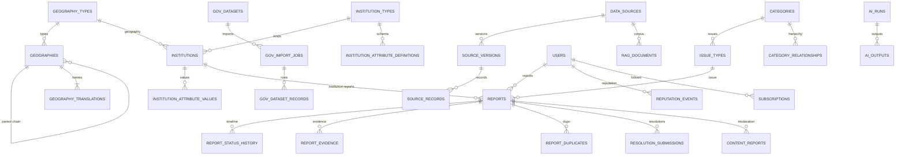

# DATABASE DESIGN — Cycle 2 (Phase 3)

**Version:** 3.0
**Date:** 2026-08-16
**Status:** Approved. Cycle-1 core (users/auth/civic/reports/media/gis/ai/
notifications/measurement — migrations 0001–0009) + **Phase-3 Cycle-2 domains**
(identity expansion, geography registry, institutions, provenance domain,
categories v2 + issue types, reports v2, evidence + media pipeline,
duplicates, community + moderation, resolution + reputation + subscriptions,
content translations, AI outputs/feedback/eval, RAG documents, government
datasets, analytics — migrations 0010–0020). Head: `0020_fix_versioning_uniques`.

## 1. Platform & Conventions

- PostgreSQL 16 + PostGIS 3.4 (compose `postgis/postgis:16-3.4`); RDS 16 for
  production (PostGIS + pgvector native — see §7).
- Alembic migrations; **fresh-database round trip verified** (upgrade head →
  downgrade base → upgrade head) in this phase.
- UUID PKs for all business entities — no sequential ids exposed.
- UTC `timestamptz`; `created_at`/`updated_at` everywhere; `deleted_at` only
  where law/integrity demands (users, institutions, posts).
- Reference data: `CHECK` constraints for enums; JSONB only for
  config/payload fields; **query-critical columns are real columns**.
- **Provenance is first-class** (PRD §6, §13): every external row carries
  source + version; trust tiers are schema-enforced.

## 2. Entity Map (Cycle-2 additions in bold)

| Domain | Tables |
|--------|--------|
| identity | **permissions, role_permissions, oauth_accounts, sessions, email_verifications, password_reset_tokens, security_events** + users/roles/user_roles/refresh_tokens (0001) |
| geography | **geography_types, geographies, geography_translations** + gis_boundaries/versions/places (0004/0009/0011) |
| institutions | **institution_types, institutions, institution_attribute_definitions, institution_attribute_values, institution_translations** |
| departments | **department_types, departments, department_categories, jurisdiction_scopes (per-category), organization_verifications, department_users** (0021–0023) |
| civic cases | **cases, case_status_history, case_assignments, case_actions, case_responses, case_reopen_requests, sla_policies, sla_instances, sla_pauses, escalation_rules, case_escalations** (0024–0026) |
| provenance | **data_sources, source_documents, source_versions, data_imports, source_records, provenance_records_v2** + external_sources/provenance_records (0003) |
| categories/issues | **category_translations, category_relationships, issue_types** + categories (0002) |
| reports | **reports_v2 columns (institution_id, issue_type_id, severity, visibility, source)**, report_evidence, media_processing_jobs, report_duplicates + reports/history/verifications (0005) |
| media | media_objects, report_media (0005) + **evidence + pipeline** (0015) |
| community | **posts, reactions, institution_followers, geography_followers, bookmarks** + report_comments/followers (0005) |
| moderation | **content_reports, moderation_actions, moderation_decisions, moderation_appeals** |
| resolution | **resolution_submissions, resolution_evidence, resolution_verifications, resolution_disputes** |
| reputation | **reputation_policies, reputation_events** (users.trust_score from 0001) |
| subscriptions/notifications | **subscriptions, devices** + notification_* (0006/0008) |
| i18n | **content_translations** + locales/translations (0003) |
| AI | **ai_outputs, ai_feedback, ai_evaluations** + ai_runs/annotations/citations/reviews (0006/0007) |
| RAG | **rag_documents, rag_document_versions, rag_chunks** |
| govdata | **gov_datasets, gov_import_jobs, gov_dataset_records** |
| analytics | **analytics_events, analytics_daily** + measurement_snapshots (0006) |
| audit | audit_logs (0001) — append-only |

## 3. Key Relationships & Semantics

- geography: `type` (code) → `parent` (row) → translations (per locale); the
  registry is level-agnostic (no India names hard-coded).
- institution: type → attribute definitions → typed values; translations;
  `location` POINT + optional geometry; verification_state is CHECK-bound.
- reports v2: `institution_id`/`issue_type_id` nullable FKs (location-only
  reports remain valid); `severity` CHECK; `visibility` CHECK; duplicates
  only suggested by AI (status `possible|confirmed|rejected`).
- forms/categories: versioned `form_schema`; reports bind by category +
  issue_type; category hierarchies via category_relationships.
- time-travel: `source_records` unique is **(source_id, external_key,
  source_version_id)** — multiple versions of one record coexist
  (fixed in 0020); `gov_dataset_records` unique is (dataset_id,
  import_job_id, external_key); queries answer "what did the data say at
  time T".

## 4. Indexes (what each supports — Phase-3 additions)

| Index | Supports |
|-------|----------|
| IX geographies (parent) / (type_id,name) / (normalized_name) | tree navigation, name lookup |
| GIST idx_geographies_geom + centroid | containment, reverse geocode (auto via GeoAlchemy2) |
| IX report_duplicates (report_id, status) + (candidate_report_id) | duplicate queue + reverse lookup |
| IX media_processing_jobs (status, created_at) | worker poll |
| IX resolution_submissions (report_id, status) | resolution workflow |
| IX content_reports (status, created_at); moderation_actions (content_type, content_id) | moderation queues |
| IX security_events (user_id, created_at); sessions(user_id); oauth(user_id) | identity flows |
| IX reputation_events (user_id, created_at) | reputation ledger |
| IX subscriptions target (unique composite) | follow/subscription lookups |
| IX analytics_events (kind, occurred_at) + (geography_id, occurred_at); analytics_daily cells | analytics pipelines |
| IX rag_chunks (embedding_status) | embedder worker |
| IX gov/import + records (valid_to) | gov ingest + time queries |

## 5. PostGIS Strategy

- WGS84 (4326) for all application geometries; boundaries via ST_GeomFromGeoJSON
  ETL with provenance; report location as a Point; registry + institutions as
  MultiPolygon/Point; reverse-gecode via ST_Covers(geom, ST_GeomFromGeoJSON);
  proximity via geography casts (metres); GIST indexes auto-created by
  GeoAlchemy2 (ADR-027/042) — no manual GIST duplicates.

## 6. Partitioning

- **Deferred** (documented analysis): `reports` (partition by created_at) and
  `analytics_events` (by month) are the candidates when their sizes cross
  ~50–100M rows or purge pressure appears; `audit_logs` stays append-only +
  index-trimmed with retention at the app layer. No premature partitioning.

## 7. Retention, Backup, Migration Strategy

- Retention per DATABASE-1-cycle §7 table (users 90-day grace,
  AI logs 90d, media per campaign, audit indefinite).
- Backups: RDS automated backups (7d, encryption at rest) in production;
  PITR available; dev compose volumes.
- Migrations: incremental Alembic; fresh-DB + downgrade round trip in CI and
  verified this phase; no destructive migration without explicit review;

  migration numbering is the revision source of truth.
- pgvector note (ADR-042): `rag_chunks.embedding` is added in a follow-up
  migration once the instance can host the `vector` extension (RDS native;
  compose image constraint documented).

## 8. ER Diagram (core clusters)

## 9. Seeds (Phase 3 — synthetic, clearly labelled)

- permissions ×15, geography_types ×12, issue_types ×21 (mapped to seeded
  categories by slug), reputation_policies ×8 (balanced deltas).
- No fabricated stats: any future directory data requires a provenance
  source (PROVENANCE.md discipline; dev fixtures explicitly labelled).

## 10. Phase 14 additions (migrations 0021–0026)

Registry (0021–0023):

- `department_types` (name en/hi, sort_order, is_active) — taxonomy for the
  department registry.
- `departments` (slug unique, name en/hi, description, `meta` column →
  JSONB `metadata`; FKs: parent, type, department_category; status
  `active|inactive|archived`; audit cols).
- `department_categories` + `jurisdiction_scopes` (one row per category,
  scope_type `full|geography|institution`).
- `organization_verifications` (state `pending|verified|suspended|revoked`,
  verified_by FK, verified_at, decided_at, note) — a verified organization
  auto-creates a `department_users` membership row for the requester.
- `department_users` (user FK, department FK, role_in_department
  `member|manager|reviewer`, status, unique (department_id, user_id)).

Cases (0024–0026):

- `cases` (case_no unique `TK-YY-xxxxxxxxxxxx`, report_id FK, category_id,
  issue_type_id, severity, jurisdiction FK, primary_department_id FK,
  source_role, status — CHECK-bound, current_sla_id, resolution_verified_at,
  timestamps). Note the deliberate plain `cases` table name (ADR-051) —
  `CivicCase` maps to it.
- `case_status_history` (case_id, from_status, to_status, note, actor_id,
  changed_at) — append-only; the case timeline's source of truth.
- `case_assignments` (case_id, department_id, assigned_by, assigned_at,
  is_current, previous_department_id, closed_at) — append-only chain.
- `case_actions` (case_id, title, status `pending|completed|cancelled`,
  due_date, completed_at, assigned_to FK nullable).
- `case_responses` (case_id, kind `public|internal_note`, body, author_id).
- `case_reopen_requests` (case_id, requested_by, reason, status
  `pending|approved|rejected`, decided_by, decision_at, staff_note).
- `sla_policies` (name, slug unique, enabled, match_scores
  department/category/issue_type/severity, response_due_hours,
  resolution_due_hours, fallback) — **data-driven SLA, no hard-coded
  department policies**.
- `sla_instances` (case_id, policy_id, started_at, target_resolution_at,
  paused_seconds, status `active|paused|breached|exempt|closed`).
- `sla_pauses` (sla_id, paused_at, resumed_at, reason, paused_by).
- `escalation_rules` (name, slug unique, trigger_event `sla_breach`, level,
  enabled, max_level, notify_roles, response_due_hours, resolution_due_hours).
- `case_escalations` (case_id, level, status `open|closed`, escalated_by,
  escalated_at, reason, target_user_id, resolved_by, resolved_at) — unique
  (case_id, level, status) for idempotent engine escalation.

Semantics:

- Every case mutation writes `case_status_history`; reopening goes through
  `case_reopen_requests` (citizen request → staff approve) — citizens never
  mutate status directly.
- SLA instance pause seconds accumulate; elapsed time excludes pauses;
  `escalate_on_breach` is idempotent per (case_id, level, status) and capped
  at `EscalationRule.max_level`.
- Seeded Phase 14 rows: 19 permission keys (incl. `sla.manage`,
  `cases.reopen`, `resolution.review`), roles `department_representative`,
  `department_manager`, `reviewer`, `escalation_rules` (`sla-breach-l1`),
  `sla_policies` (`default-24h`).
- Migration 0026 was verified head-to-head on real Postgres (PostGIS 16);
  the pre-existing 0022 revision id (33 chars) requires a local-only
  `ALTER TABLE alembic_version ALTER COLUMN version_num TYPE varchar(64)`
  on older dev databases before upgrading.

## 11. Phase 15 additions (migration 0031)

Community confirmation on resolved cases (PRD §B.2):

- `resolution_followups` (case_id FK, report_id FK, resolution_submission_id
  FK, user_id FK, signal `observed_improvement|issue_still_exists`
  CHECK-bound, observation, status `pending|confirmed|escalated|dismissed`
  CHECK-bound, reviewed_by/reviewed_at/review_note, created_at) — one
  citizen signal per case; **unique (case_id, user_id)** prevents double
  voting. Indexes: (report_id, created_at), (case_id, status).
- `resolution_reopen_signals` (case_id FK, signal_count, raised_by_user_id,
  status `pending|approved|dismissed`, decided_by/decided_at/decision_note,
  created_at) — aggregate review queue. Index: (status, created_at).
- `cases.community_confirmed_at` (timestamptz, nullable) — set when the
  two-confirmer gate (reporter + one more citizen confirming the
  improvement) is met; the durable marker analytics reads for
  `community_confirmed_count` / two-confirmer closures.
- Seeded 6 notification templates (hi/en) for `resolution.followup_confirmed`,
  `resolution.reopen_signal`, `resolution.reopen_approved`.

Semantics:

- Follow-up signals never transition the case themselves: the confirm gate
  only records + marks `confirmed`; the reopen signal only queues a pending
  `resolution_reopen_signals` row. Human review (approve) reopens through the
  existing `case_reopen_requests` machinery; dismiss leaves the case closed.
- Migration 0031 was downgrade→upgrade round-tripped on real Postgres; the
  downgrade drops the tables, column and templates.
