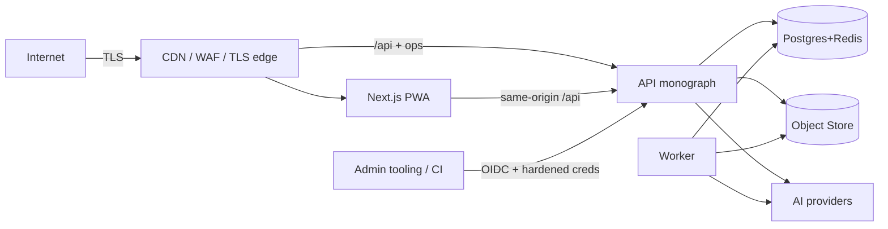

# SECURITY MODEL — Theek Karo

**Version:** 2.0 (Cycle 2, Phase 2)
**Date:** 2026-08-16
**Status:** Approved — design; Cycle-1 hardening (headers, secrets handler,
scan gates, runbooks, DPDP memo) is the baseline; `SECURITY-CHECKLIST.md`
tracks implementation status.

---

## 1. Trust Boundaries

| Boundary | Trust | Notes |
|----------|-------|-------|
| Public edge → web/API | untrusted input | rate limits, validation, TLS, WAF |
| Web → API | bearer JWT | short-lived; refresh rotation; CORS locked |
| API ↔ worker | none (same trust class) | jobs carry actor ids; row-state idempotency |
| API/worker → DB/Redis | strongest internal | network-isolated SG; least-privilege DB users |
| API/worker → AI providers | semi-trusted | PII-insulated payloads; no-training contract; no secrets to prompts |
| Admin tooling | privileged | OIDC, MFA-forced at release, every action audited |

## 2. Authentication

- OTP (console dev channel; DLT SMS in V1) with attempts lockout + resend
  cooldown; password with argon2id; JWT access (15 min) + rotating refresh
  with reuse detection (carried); password reset (V1); OAuth identity linking
  for official/institution verification (V1); **MFA-ready**: TOTP scaffolding,
  enforced for officials/admins at release hardening.

## 3. Authorization (RBAC + permission keys)

Personas (PRD §2) map to immutable roles; **permission keys** (e.g.
`reports.transition.assigned`, `institutions.twin.update`, `moderation.strike`)
form the actual check surface; roles are bundles of keys; object-level checks
(owner, institution-linked, geography-scoped) guard row reads/writes; admin
grants audited; superadmin actions break-glass + dual-approved.

## 4. API Security

- RFC 9457 errors; security headers middleware; idempotency keys on creates;
  per-module rate limits (auth strict, writes moderate); pagination caps;
  input size limits; TLS/HSTS + WAF at the edge (deploy phase); OpenTelemetry
  request logging without PII.

## 5. File Security

- Presigned PUT/GET (15-min), private-by-default buckets; scan gate before
  `available` (magic bytes; ClamAV slot; virus-scan failure → `failed`, never
  served); mime/size whitelists; EXIF/miniature stripping for profile/media
  privacy (V1); downloads of private originals audited; thumbnails served via
  CDN only.

## 6. AI Security

- PII insulation in prompts/logs (ADR-019); T4-only labelling (schema CHECK);
  eval floors enforced by the router; human review for irreversible actions;
  provider no-training contract; output validation (schema) before any
  downstream use; agent budgets + step audit.

## 7. Secrets

- Dev: env + `.env.example` documentation; runtime: AWS Secrets Manager via
  ECS `secrets` (baseline Terraform wired); CI: OIDC (no static cloud keys);
  media object-store creds scoped IAM user; no secrets in images/logs.

## 8. Privacy (DPDP-aligned)

- Consent registry (purposes, versions, revocation) carried; purpose-bounded
  collection; retention schedule (DATABASE §7, DPDP memo); rights: access,
  rectification, erasure with grace + anonymisation; minimisation by schema;
  children: not targeted, self-certified consent; grievance channel wired at
  release; counsel review tracked.

## 9. Auditability

- Append-only `audit_logs` for every sensitive action (auth, RBAC, admin,
  moderation, institution-claim, official posts, AI gates, erasures);
  module-typed entity references; read access controls on audit exports;
  reports/twins carry their own append-only timelines (system-of-record
  auditability without PII sprawl).

## 10. Incident Response

Severity ladder + runbooks (RUNBOOKS.md) incl. the DPDP breach workflow;
alerts from SLO rules; deploy/rollback pipeline supports rapid revert.

## 11. Frontend Client Security (Phase 6)

- **Authentication & Storage**: JWT tokens stored securely in client storage; request authorization automatically injected via `Authorization: Bearer <token>` headers on authenticated API operations.
- **XSS & Injection Protection**: React 19 JSX auto-escaping; zero `dangerouslySetInnerHTML` usage in user-generated civic content or comments; search query parameters sanitized via URLSearchParams encoding.
- **Content Security & Media**: Evidence upload restricted to verified MIME types (`image/jpeg`, `image/png`, `image/webp`, `video/mp4`) with client file size boundary validation (8MB max) prior to API transmission.
- **Privacy Minimization**: Masked contact display for citizen users (`user.contact_masked`); optional GPS accuracy metadata displayed without exposing private personal identifiers.

## 12. Departments, Cases, SLA & Resolution Security (Phase 14)

- **Department-scoped access**: case reads/mutations are gated by `_user_can_access_case` — department roles must belong to the case's primary department; `super_admin`/`admin`/`moderator` bypass scope; case creator and reporter always read. Citizens never mutate a case directly (agency = reopen requests, staff-approved).
- **Role model**: three new roles (`department_representative`, `department_manager`, `reviewer`) wired into every role block; 19 new permission keys incl. `sla.manage` (admin-gated — SLA clock pause/resume is tamper-free), `cases.reopen`, `resolution.review`. Manual escalation requires manager-on-case or admin; non-members are 403.
- **Resolution integrity**: independent reviewer must differ from the submitter (self-review forbidden); review decisions are append-only (`ResolutionReview` rows) and map to CHECK-bound case statuses.
- **Privacy**: citizens list only their own cases; public timelines strip internal notes; evidence `visibility` field distinguishes public vs internal material.
- **Auditability**: every transition writes `case_status_history` (actor, from/to status, note, timestamp) — the case timeline is an immutable ledger.
- **Worker isolation**: the SLA sweep (`evaluate_sla_due`, 60 s beat) only evaluates due clocks and creates escalations; it cannot mutate case status.